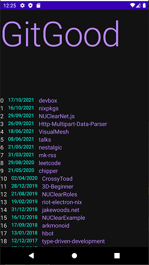

# GitGood

An app that helps you stay on track of your programming project goals.
*A little bit everyday is the GitGood way*

Thank-you Jake for donating your data to the cause

# TO-DO

- Honestly too much to list
- Get the data rending into something useful.
- Some sort of login/validation system how hard could this be

# Vision

I find keeping on track with goals a hard thing to do. I use many tools to help keep me motivated 
and always moving towards where I want to be, GitGood aim is to be another one of those tools. 
